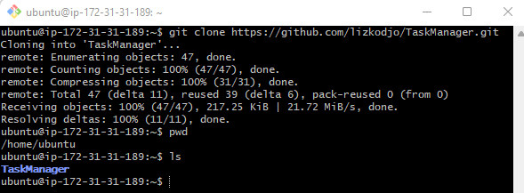

# Two tier deployment using an Auto Scaling Group (ASG) with a Load Balancer (LB)

## Task Manager App

To explain how to build a two tier deployment, I created a simple task management application using Flask and MongoDB.

**N-tier architecture** is a client-server software design which breaks the application into logical and physical separated tiers to improve scalability, maintainability and security.

In my project, I have divided the application into two, the Client tier (user interface and application logic) and a Server tier (database).

### Creating and Testing App

I created my app and tested it locally. I connected it to my MongoDB Atlas account to make sure the database is created and data was being stored correctly.


After testing and confirming the database was created and data received correctly, I then started making changes to ensure I could deploy it on AWS.

To do this, I created scripts for the client and server tiers. The script to create the app can be found [here](/scripts/app-deploy.sh) and the script for the database is [here](/scripts/db-deploy.sh)

## 🗃️ Client Tier

To create this tier, I logged into AWS and created an EC2 instance with the following:

- **_EC2 Instance_**:
  - **AMI (Amazon Machine Image)**
    - Ubuntu 22.04 LTS
  - **Instance type**
    - t3.micro (free tier)
  - **Security Group Rules**
    - SSH - 22 (My IP address so I can connect)
    - HTTP - 80 (Web traffic (Nginx will use this))
    - Custom TCP - 5000 (Flask access for testing)

- **_Connect to EC2 Instance_**:

  ```bash
  # Create key file and secure key
  chmod 400 your-key.pem

  # Connect (copy connection string from AWS)
  ssh -i your-key.pem ubuntu@YOUR_EC2_PUBLIC_IP
  ```

- **_Update System_**

  ```bash
  # Update packages
  sudo apt update -y

  # Upgrade packages
  sudo apt upgrade -y
  ```

- **_Install Python, nginx and Git_**
  - _python3-pip_ - Package manager for python
  - _python3-venv_ - Isolated Python environment
  - _git_ - Clone my code from GitHub
  - _nginx_ - Web Server

  ```bash
  sudo apt install -y python3-pip python3-venv git nginx
  ```

- **_Configure nginx (Reverse Proxy)_**

  ```bash
  cd /etc/nginx/sites-available

  # Configure default document
  sudo nano default

  # Forward dynamic request
  location / {
      proxy_pass http://127.0.0.1:5000;
  }

  # Start nginx for changes to be registered
  sudo systemctl start nginx -y
  ```

- **_Clone and Setup Application_**

  ```bash
  # Clone my code
  git clone https://github.com/lizkodjo/TaskManager.git
  cd TaskManager
  ```

  

  ```bash
   # Create virtual environment
   python3 -m venv venv

   # Activate it
   source venv/bin/activate

   # Install dependencies
   pip install -r requirements.txt

  ```

- Before running the app, set up the database, because you need the database public IP4 address to connect to it.

## 🗄️ Server Tier

To create this tier, I created another EC2 instance with the following:

- **_EC2 Instance_**:
  - **AMI (Amazon Machine Image)**
    - Ubuntu 22.04 LTS
  - **Instance type**
    - t3.micro (free tier)
  - **Security Group Rules**
    - SSH - 22 (My IP address so I can connect)
    - Custom TCP - 27017 (MongoDB)

- **_Connect, update and upgrade _**

  Update and upgrade packages installed to latest versions

  ```bash
  # Install gnupg and curl (curl may already be installed, but I include this in my scripts, just in case)

  sudo apt install gnupg -y
  sudo apt install curl -y
  ```

- Install mongodb by connecting and downloading it with the following command

  ```bash
  # Install mongodb

  curl -fsSL https://www.mongodb.org/static/pgp/server-7.0.asc | \
  sudo gpg -o /usr/share/keyrings/mongodb-server-7.0.gpg --dearmor
  ```

- The next step is to create a configuration and source list file by running the following command after which I update, install and start mongodb

  ```bash
  echo "deb [ arch=amd64,arm64 signed-by=/usr/share/keyrings/mongodb-server-7.0.gpg ] https://repo.mongodb.org/apt/ubuntu jammy/mongodb-org/7.0 multiverse" | \
  sudo tee /etc/apt/sources.list.d/mongodb-org-7.0.list

  #    Update
  sudo apt update -y

  # Install
  sudo apt install -y mongodb-org

  # Start
  sudo systemctl start mongod
  ```

- Now I have to configure mongodb to make sure my app can connect to it

  ```bash
  # find the mongoconf file and update the bindIp
  cd /etc/mongod

  sudo nano mongodconf
  # Change bindIp froom 127.0.0.1 to 0.0.0.0

  # restart and enable mongodb
  sudo systemctl restart mongod

  # enable mongod, this makes it a startup process
  sudo systemctl enable mongod

  ```

  

- Get your database public ip address from AWS

## 🚀 Start App

- On your app instance set up an environment variable for the mongod connection (if still logged into your virtual env, it will still work)

  ```bash
  export MONGO_URI=mongodb://DBPublicAddress:27017
  ```

- Start app

  ```python
  python app.py
  ```

- View app by copying the app's public ip address (Easy to find on AWS, the instance summary page) and entering it in the browser. The Task Manager application should be displayed.

  
